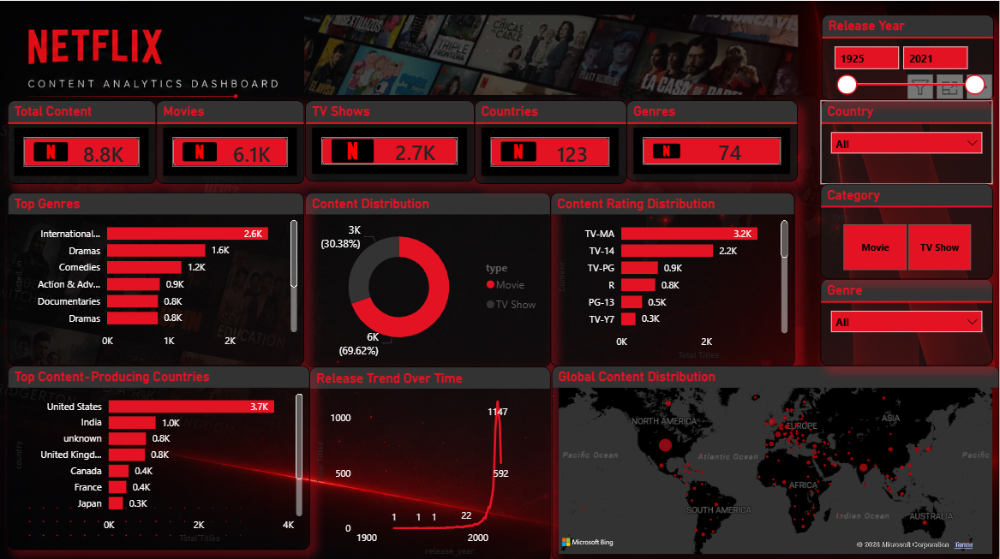

# 🎬 Netflix Content Analytics Dashboard

An interactive Power BI dashboard that analyzes Netflix's global content catalog, providing insights into movies, TV shows, genres, ratings, release trends, and geographical distribution.

---

## 📌 Project Overview

This dashboard was created to analyze Netflix's content library using Power BI. It enables users to explore the dataset through interactive filters and visualizations while identifying key trends in Netflix's catalog.

---

## 📊 Dashboard Preview



---

## 🚀 Features

- Interactive Power BI Dashboard
- KPI Cards
- Content Distribution Analysis
- Rating Distribution
- Release Trend Analysis
- Genre Distribution
- Country-wise Content Analysis
- Global Content Map
- Interactive Slicers

---

## 📈 Key KPIs

- 📺 Total Content
- 🎬 Total Movies
- 📡 Total TV Shows
- 🌍 Total Countries
- 🎭 Total Genres

---

## 📊 Dashboard Visuals

- Content Distribution
- Top Content-Producing Countries
- Content Rating Distribution
- Release Trend Over Time
- Top Genres
- Global Content Distribution

---

## 🛠 Tools Used

- Power BI Desktop
- Power Query
- DAX
- Data Modeling
- Microsoft Bing Maps

---

## 📂 Dataset

Netflix Movies and TV Shows Dataset

Source:
https://www.kaggle.com/datasets/shivamb/netflix-shows

---

## 💡 Business Insights

- Movies represent the majority of Netflix's content library.
- TV-MA is the most common content rating.
- The United States contributes the highest number of titles.
- Netflix experienced rapid content growth after 2015.
- International Movies are among the most common genres.

---

## 📁 Repository Structure

```
Netflix-Content-Analytics-Dashboard/
│
├── Netflix Dashboard.pbix
├── README.md
├── LICENSE
│
├── dataset/
│   └── netflix_titles.csv
│
└── images/
    └── dashboard.png
```

---

## 👨‍💻 Author

Rahul Kumar

GitHub:
https://github.com/rahulkr4536

LinkedIn:
www.linkedin.com/in/rahul-kumar-0076b7369

---

⭐ If you found this project useful, consider giving it a star.